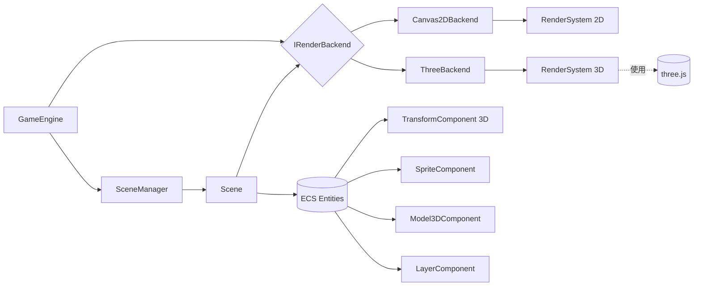
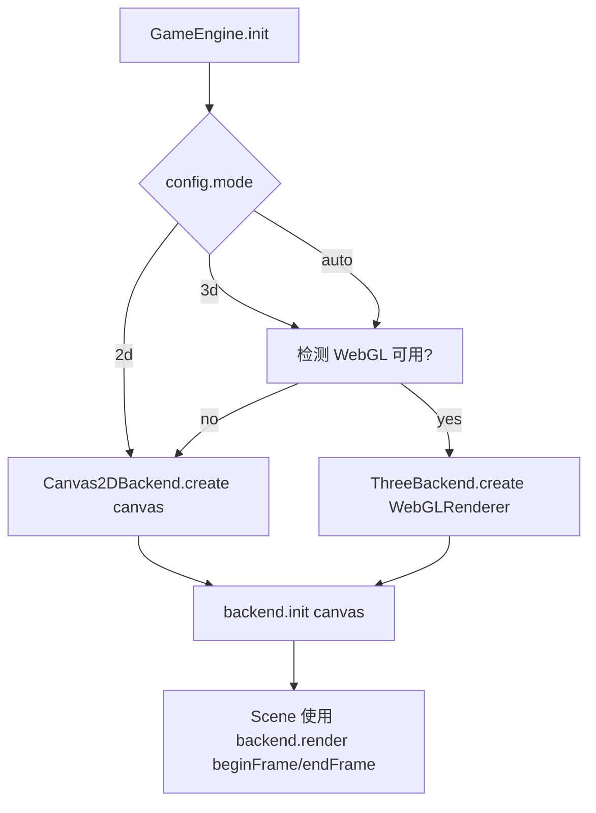
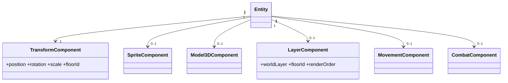

# 双后端渲染架构（2D/3D）与世界高度/分层系统 · 技术设计

## 1. 概述

本设计为现有 HTML5 MMRPG 项目引入一层渲染后端抽象，使项目能够：

- 同时支持 Canvas 2D（现有）与 three.js 3D 两套渲染后端，运行时可切换。
- 将现有"视觉 hack 式高度"（`offsetY`、飞行弧线）统一到真实的三维 `Transform`，由渲染层自动投影。
- 建立清晰的分层语义：世界子层（WorldSublayer）、地图楼层（MapFloor）、屏幕层（ScreenLayer），三类互不耦合。
- 保持现有 ECS、业务系统、UI 面板、网络、剧情等模块的零/低改动。

## 2. 目标与非目标

### 2.1 目标

1. 新增 `IRenderBackend` 抽象，2D 和 3D 各实现一份；`GameEngine` 仅依赖抽象。
2. `TransformComponent` 升级为三维 `{x, y, z}`，并提供 2D 兼容访问器（`screenY`、`elevation`）。
3. 2D 后端按新的 Transform 维度工作时视觉效果与当前一致（回归为 0）。
4. 3D 后端可加载同一份 ECS 实体数据，并用正交相机 + 2.5D 精灵 billboard 呈现接近现在的风格。
5. 新增世界子层与地图楼层语义，支持多层地图（1F/2F/地下），由 `MovementSystem` 按 `floorId` 做碰撞。
6. 后端切换通过 URL 参数或配置（`?mode=2d|3d|auto`）完成，`auto` 时按 WebGL 能力降级。
7. 所有现有业务系统（Combat/Attribute/Skill/Quest/Network/…）不改变外部接口。

### 2.2 非目标

- 不引入物理引擎（cannon/ammo），碰撞仍基于瓦片/AABB。
- 不替换现有 UI 面板（DOM/Canvas2D overlay）。
- 不要求 3D 美术资产一次到位，初期使用 2.5D 精灵 billboard 即可。
- 不做移动端触控的 3D 手势（保留现有输入行为）。

## 3. 需求回溯

来源于与用户的三轮讨论，关键能力点：

- **R1** 引入 three.js / Canvas 2D 双后端，业务层保持不变。
- **R2** 运行时选择后端；3D 不可用时自动降级为 2D。
- **R3** Transform 升三维；现有 2D 调用点不报错、表现一致。
- **R4** 渲染子层（ground/decal/entity/aerial/effect）统一管理排序。
- **R5** 多层地图（`floors`）与 `floorId` 支持，楼层切换有 portal。
- **R6** 视觉高度从 `offsetY` hack 升级到真实 `position.y`（以 `FlightSystem` 为首个受益者）。
- **R7** UI/HUD（DOM + overlay）在两种后端下行为一致。
- **R8** 鼠标拾取统一经 `IPicker`，2D 复用 `Camera.screenToWorld`，3D 用 `Raycaster`。
- **R9** 提供迁移期间的兼容访问器，保证存量代码一次迁移、分步替换。


## 4. 架构总览

### 4.1 分层架构

```
┌───────────────────────────────────────────────────────────────┐
│  业务层（零改动）                                              │
│  Combat / Attribute / Skill / Quest / NPC / Network / Prologue │
├───────────────────────────────────────────────────────────────┤
│  ECS 数据层（小改 + 新增组件）                                  │
│  Entity + TransformComponent(3D) + SpriteComponent             │
│                    + Model3DComponent(新) + LayerComponent(新) │
├───────────────────────────────────────────────────────────────┤
│  渲染抽象层（新增）                                             │
│  IRenderBackend | ICameraAdapter | IPicker | IParticleRenderer │
├────────────────────────┬──────────────────────────────────────┤
│  Canvas2DBackend       │   ThreeBackend                       │
│  - RenderSystem2D      │   - RenderSystem3D                   │
│  - SpriteRenderer      │   - SpriteRenderer3D (billboard)     │
│  - Camera2D            │   - Camera3D (Orthographic)          │
│  - ParticleRenderer2D  │   - ParticleRenderer3D (Points)      │
│  - Picker2D            │   - Picker3D (Raycaster)             │
└────────────────────────┴──────────────────────────────────────┘
```

### 4.2 关键依赖关系



### 4.3 切换流程



### 4.4 帧循环（不变 + 适配）

`GameEngine.gameLoop` 不变，仅把 `render(ctx)` 改为 `render(backend)`：

```mermaid
sequenceDiagram
  participant Loop as gameLoop
  participant SM as SceneManager
  participant SC as GameScene
  participant BE as IRenderBackend
  Loop->>SM: update(dt)
  Loop->>BE: beginFrame()
  Loop->>SM: render(backend)
  SM->>SC: render(backend)
  SC->>BE: renderEntities(entities, camera)
  SC->>BE: renderParticles(particles, camera)
  SC->>BE: renderEffects(effects, camera)
  Loop->>BE: endFrame()
```


## 5. 数据模型设计

### 5.1 坐标系约定

| 轴 | 含义 | 对应 2D | 对应 3D (three.js) |
|---|---|---|---|
| `x` | 水平方向（左右） | 屏幕 x | three `x` |
| `y` | 高度方向（上下，离地高度） | 不参与 2D 位置，只作视觉偏移 | three `y` |
| `z` | 深度方向（前后，地面平面） | 屏幕 y（Y-sort 用） | three `z` |

原 2D 代码里的 `position.y` **语义上等于新的 `position.z`**。通过兼容 getter，既不破坏存量也不引入双坐标系。

### 5.2 TransformComponent（升级）

```
TransformComponent
  position: { x, y, z }              // 三维真实坐标，y 默认 0
  rotation: { x, y, z } | number     // 3D 欧拉角；2D 兼容单值 Z 旋转
  scale:    { x, y, z }              // z 默认 1
  floorId:  string                   // 所属楼层 id，默认 'ground'

  // 兼容 getter（迁移期）
  get screenY()   { return this.position.z }
  get elevation() { return this.position.y }

  setPosition(x, y, z = this.position.y)  // 旧调用 setPosition(x, y) 等价于 setPosition(x, 0, y)？见 §9 迁移策略
```

**关键抉择**：因为现有代码中 `position.y` 使用极广（移动、AI、碰撞、UI），一次性把 `y` 改为"高度"会引入大面积回归。设计采用 **双阶段迁移**（§9 详述）：

- 阶段 A（兼容期）：`TransformComponent` 对外仍暴露 `position.y` 作为"地面坐标"，内部同步维护 `position.z = position.y` 与 `position._height = 0`；`Transform3DAdapter` 在读取时返回 `{x, _height, y}` 供 3D 后端使用。
- 阶段 B（目标态）：代码全量切到 `{x, y=高度, z=地面}`，移除兼容别名。

### 5.3 新增组件

```
LayerComponent('layer')
  worldLayer: 'ground'|'decal'|'entity'|'aerial'|'effect'  // 默认 'entity'
  floorId:    string                                        // 冗余于 Transform，便于查询
  renderOrder: number                                       // 同层内手动微调（可选）

Model3DComponent('model3d')         // 可选；仅 3D 后端使用
  modelAsset: string                  // glTF 资产 id
  animationMap: { idle, walk, attack, ... }
  scale: number
  rotationOffset: number              // 朝向修正
```

`SpriteComponent` 不动，新增一个只读方法：
```
SpriteComponent.getBillboardPlane() → { width, height, pivot: 'bottom'|'center' }
```
供 3D 后端创建 `PlaneGeometry + THREE.Texture` 使用。

### 5.4 ECS 组件拓扑




## 6. 渲染后端抽象接口

### 6.1 IRenderBackend

```
interface IRenderBackend {
  readonly mode: '2d' | '3d'
  readonly canvas: HTMLCanvasElement
  readonly camera: ICameraAdapter
  readonly picker: IPicker

  init(canvas: HTMLCanvasElement, config: BackendConfig): Promise<void>
  resize(width: number, height: number): void
  dispose(): void

  beginFrame(): void
  endFrame(): void

  renderEntities(entities: Entity[], camera: ICameraAdapter): void
  renderParticles(particles: ParticleBuffer, camera: ICameraAdapter): void
  renderEffects(effects: EffectBuffer, camera: ICameraAdapter): void

  // 场景级设置
  setMapData(mapData: MapData): void    // 地形、楼层、地面贴图
  setEnvironment(env: EnvironmentConfig): void  // 背景色/光照（3D 时生效）
}
```

### 6.2 ICameraAdapter

```
interface ICameraAdapter {
  // 对外接口（业务层调用）
  setTarget(target: TransformComponent | { position }): void
  update(deltaTime: number): void
  setBounds(minX, minZ, maxX, maxZ): void

  worldToScreen(worldPos: Vec3): { x, y }
  screenToWorld(screenX, screenY, groundY?: number): Vec3

  // 视锥/可见性
  isVisible(worldPos: Vec3, radius: number): boolean

  // 仅 3D 后端有效
  setAngle(pitchDeg: number, yawDeg: number): void
}
```

- 2D 实现内部持有现有 `Camera`，`worldToScreen` 做 Y 压缩与等距偏移（保持现表现）。
- 3D 实现内部持有 `THREE.OrthographicCamera`（默认 30° 俯角、45° 绕 Y），`screenToWorld` 走 `Raycaster` 打地面平面。

### 6.3 IPicker

```
interface IPicker {
  // 把屏幕点击转成世界地面点
  pickGround(screenX, screenY): Vec3 | null

  // 在一组实体里找点击到的实体
  pickEntity(screenX, screenY, entities: Entity[]): Entity | null
}
```

- `InputManager.getMouseWorldPosition()` 内部改调 `backend.picker.pickGround()`；外部签名不变。
- `MovementSystem.findEnemyAtPosition` 可改调 `backend.picker.pickEntity()`，也可保留半径判定（不强制）。

### 6.4 IParticleRenderer（子组件）

```
interface IParticleRenderer {
  render(particles: ParticleBuffer, camera: ICameraAdapter): void
  // 可选：批量上传（3D 实现用）
  upload(particles: ParticleBuffer): void
}
```

`ParticleSystem` 仍管理生命周期与物理，**不再自行绘制**，由 `backend.renderParticles` 调用具体渲染器。

## 7. 2D 后端设计（Canvas2DBackend）

### 7.1 组件关系

- 复用现有 `RenderSystem`、`SpriteRenderer`、`Camera`、`ParticleSystem`（绘制部分）
- 新增 `Canvas2DBackend` 作为包装层，实现 `IRenderBackend`

### 7.2 关键变更

1. **Y-sort 源切换**：`RenderSystem.sortEntitiesByDepth` 读 `transform.position.z`（通过兼容 getter 等价于旧的 `position.y`）。
2. **世界子层支持**：`cullEntities` 之后按 `entity.getComponent('layer')?.worldLayer` 分桶，渲染顺序：
   - `ground` → `decal` → `entity`（内部按 z Y-sort）→ `aerial` → `effect`
3. **视觉高度（elevation）应用**：在精灵绘制阶段，`ctx.translate(x, z - y * kIso)`，其中 `kIso` 为等距斜率（默认 1）。即 `position.y` 越大，精灵越往屏幕上移。
4. **楼层过滤**：`cullEntities` 追加 `floorId === currentFloorId` 过滤；相邻楼层可选 `alpha = 0.3` 叠加。

### 7.3 2D 相机

`Camera2DAdapter` 包装现有 `Camera`：
- `setTarget(t)` → `camera.setTarget({ position: { get x(){return t.position.x}, get y(){return t.position.z} } })`
- `worldToScreen({x,y,z})` → `{ sx: x - camX + halfW, sy: (z - camZ) + halfH - y * kIso }`
- `screenToWorld(sx, sy)` → `{ x: sx + camX - halfW, y: 0, z: sy + camZ - halfH }`

## 8. 3D 后端设计（ThreeBackend）

### 8.1 场景构成

```
THREE.Scene
├── AmbientLight
├── DirectionalLight (俯照)
├── Ground Group (按 floorId 分组)
│   ├── floor_ground: Plane + Texture
│   └── floor_upper:  Plane + Texture
├── Entity Group (按 worldLayer 分组)
│   ├── ground_decals: InstancedMesh
│   ├── entities:      Sprite[]/Mesh[]
│   └── aerial:        Sprite[]/Mesh[]
├── Effects Group
└── Particles (THREE.Points)
```

### 8.2 相机

- 默认 `OrthographicCamera`，尺寸与游戏分辨率按比例匹配；斜角 `x=-30°, y=45°`，观感接近等距。
- 提供 `setMode('ortho' | 'perspective')` 以便后续切到透视。
- 跟随目标：复用 `Camera2DAdapter` 的 `setTarget` 逻辑，但应用到 `camera.position` 与 `lookAt` 偏移。

### 8.3 精灵 billboard 渲染

- 每个带 `SpriteComponent` 的实体对应一个 `THREE.Sprite` 或 `Mesh(PlaneGeometry, MeshBasicMaterial{ map: texture })`。
- 8 方向动画映射为 texture `offset/repeat` 更新，逻辑完全复用 `SpriteComponent.getCurrentFrame()`。
- 为贴近 2.5D 观感，`Sprite` 垂直朝向相机（billboard），水平保持世界方向。
- `SpriteComponent.setDirectionFromVelocity` 的 8 方向结果仍可用，3D 下需额外做一次"相对相机方向"的旋转偏移。

### 8.4 模型渲染（可选）

- 实体若带 `Model3DComponent` 则优先走 glTF 路径（`THREE.AnimationMixer`）。
- 同一实体 `SpriteComponent + Model3DComponent` 共存时：
  - 2D 后端：只用 Sprite
  - 3D 后端：优先 Model3D，Sprite 作为降级

### 8.5 楼层与遮挡

- 每个楼层对应一个 `THREE.Group`，整体 `position.y = floor.elevation`。
- 玩家当前楼层之外的层：
  - 上层：相机视线穿透时 `material.transparent = true, opacity = 0.2`（可配置）
  - 下层：正常显示
- 多层地图的"天花板"可作为单独 mesh，靠近时淡出。

## 9. 高度与分层系统设计

### 9.1 世界子层（WorldSublayer）

| 子层 | 用途 | 2D 排序规则 | 3D 规则 |
|---|---|---|---|
| `ground` | 地面贴图、影子 | 最先绘制，不参与 Y-sort | renderOrder = 0 |
| `decal` | 地面装饰（血迹、符文） | 在 ground 之后，Y-sort | renderOrder = 1 |
| `entity` | 角色/敌人/NPC/物体 | Y-sort 主力 | renderOrder = 2 |
| `aerial` | 飞行物/投掷武器/箭矢 | 固定绘制在 entity 之上 | renderOrder = 3 |
| `effect` | 技能特效/粒子 | 最后绘制，含自定义混合 | renderOrder = 4 |

- 若实体未挂 `LayerComponent`，默认 `worldLayer='entity'`。
- `FlightSystem` 期间把玩家 `worldLayer` 临时切到 `aerial`，飞行结束恢复（避免下蹲瞬间被 decal 盖住）。

### 9.2 地图楼层（MapFloor）

```
MapData
  defaultFloor: string
  floors: MapFloor[]

MapFloor
  id:         string
  elevation:  number          // 真实高度（3D 下作为 Group.y）
  tileSize:   number
  collision:  boolean[][]     // 与现有一致
  tiles?:     TileLayer[]
  portals:    Portal[]

Portal
  x: number, z: number, radius: number
  toFloor: string
  toX: number, toZ: number
  trigger: 'touch' | 'interact'
```

- `MovementSystem` 扩展：
  - 碰撞检测按 `entity.transform.floorId` 查对应 `floor.collision`
  - 每帧末检查 portal：实体位置落在 portal 半径内且满足 trigger → 调 `teleport(entity, toFloor, toX, toZ)`
- `teleport()` 同步：
  - `transform.floorId = toFloor`
  - `transform.position = { x: toX, y: floors[toFloor].elevation, z: toZ }`
  - 触发 `floorChanged` 事件给 UI/音频

### 9.3 Elevation（高度）的统一处理

- 所有"临时抬升视觉"的逻辑统一改为修改 `position.y`（elevation）：
  - `FlightSystem.config.arcHeight` → `transform.position.y = baseElevation + arcHeight * sin(progress*π)`
  - `WeaponRenderer` 的抛物线 → 同理
  - 跳跃、浮空、击飞 → 通用
- 2D 渲染自动把 `y` 换算成精灵的屏幕 Y 偏移（见 §7.2.3）。
- 3D 渲染直接用 `mesh.position.y = y`。

### 9.4 屏幕层（ScreenLayer，HUD）

- 完全与后端解耦：
  - DOM 面板（Attribute/Inventory/Shop/...）：直接使用
  - Canvas2D HUD（HealthBar/FloatingText/Minimap）：
    - 2D 后端：直接画在主 canvas 顶部
    - 3D 后端：画在独立的 overlay canvas（`position: absolute; pointer-events: none`），叠在 WebGL canvas 上层
- 所有 HUD 需要 `worldToScreen` 的地方统一调用 `backend.camera.worldToScreen()`。


## 10. 关键算法与伪代码

### 10.1 后端选择

```javascript
// GameEngine.initBackend
function pickBackend(mode) {
  if (mode === '2d') return new Canvas2DBackend();
  if (mode === '3d') return hasWebGL() ? new ThreeBackend() : fallback();
  // auto
  return hasWebGL() ? new ThreeBackend() : new Canvas2DBackend();
}

function hasWebGL() {
  try {
    const c = document.createElement('canvas');
    return !!(c.getContext('webgl2') || c.getContext('webgl'));
  } catch { return false; }
}

function fallback() {
  console.warn('WebGL unavailable, fallback to Canvas2D');
  return new Canvas2DBackend();
}
```

### 10.2 2D 后端实体渲染（含子层与 elevation）

```javascript
// Canvas2DBackend.renderEntities
renderEntities(entities, cameraAdapter) {
  const buckets = { ground:[], decal:[], entity:[], aerial:[], effect:[] };

  for (const e of entities) {
    if (!e.active) continue;
    const t = e.getComponent('transform');
    const s = e.getComponent('sprite');
    const l = e.getComponent('layer');
    if (!t || !s || !s.visible) continue;
    if (t.floorId !== this.currentFloorId) continue;

    if (!this.camera.isVisible(t.position, s.width)) continue;
    buckets[l?.worldLayer ?? 'entity'].push({ e, t, s, l });
  }

  for (const key of ['ground','decal','entity','aerial','effect']) {
    const list = buckets[key];
    if (key === 'entity' || key === 'decal' || key === 'aerial') {
      list.sort((a, b) => a.t.position.z - b.t.position.z);
    }
    for (const { e, t, s } of list) this.drawSprite(e, t, s);
  }
}

drawSprite(entity, transform, sprite) {
  const { x, y, z } = transform.position;
  const screen = this.camera.worldToScreenGround(x, z);
  const screenY = screen.y - y * this.kIso;   // elevation → 屏幕上移
  this.spriteRenderer.renderAt(this.ctx, entity, sprite, screen.x, screenY);
}
```

### 10.3 3D 后端实体渲染

```javascript
// ThreeBackend.renderEntities
renderEntities(entities, cameraAdapter) {
  for (const e of entities) {
    const t = e.getComponent('transform');
    const view = this.entityViews.get(e.id) ?? this.createView(e);
    if (!view) continue;

    view.object3D.position.set(t.position.x, t.position.y, t.position.z);
    view.object3D.visible = e.active && t.floorId === this.currentFloorId;

    const model = e.getComponent('model3d');
    if (model && view.mixer) view.mixer.update(this.deltaTime);

    const sprite = e.getComponent('sprite');
    if (sprite && view.spriteMaterial) this.updateSpriteUV(view, sprite);
  }
  this.renderer.render(this.scene, this.camera);
}
```

### 10.4 楼层传送

```javascript
// MovementSystem.checkPortal
for (const portal of this.currentFloor.portals) {
  if (distance(entity.transform.position, portal) <= portal.radius) {
    if (portal.trigger === 'touch' || isInteractPressed()) {
      this.teleport(entity, portal.toFloor, portal.toX, portal.toZ);
    }
  }
}

teleport(entity, floorId, x, z) {
  const floor = this.mapData.floors.find(f => f.id === floorId);
  entity.getComponent('transform').floorId = floorId;
  entity.getComponent('transform').position = { x, y: floor.elevation, z };
  eventBus.emit('floorChanged', { entity, floorId });
}
```

### 10.5 飞行/抛物线（elevation 化）

```javascript
// FlightSystem.updateFlyPhase（伪代码）
const t = data.progress;
const ease = easeInOutQuad(t);
transform.position.x = lerp(data.startX, data.targetX, ease);
transform.position.z = lerp(data.startZ, data.targetZ, ease);
transform.position.y = this.config.arcHeight * Math.sin(t * Math.PI); // ← 真实高度
// 不再改 sprite.offsetY
```


## 11. 迁移策略

### 11.1 双阶段迁移

为避免一次性大范围改动导致回归，采用两阶段：

**阶段 A：兼容期（本 spec 的主要交付）**
- `TransformComponent` 同时暴露 `position.y`（旧语义=地面深度）与 `position.z`（新语义=地面深度），内部保证 `z === y`。
- 新增 `position._height`（或 `elevation`）作为真实高度，默认 0。
- 业务代码继续读写 `position.y` 即可正常工作。
- 新代码（FlightSystem、3D 后端、多层地图）使用 `position.z` + `position._height`。
- 2D 后端按新规则绘制：`screenY = (cameraProject(z)) - _height * kIso`，但因为 `z===y`、`_height=0`，与现有表现等价。

**阶段 B：清理期（后续 spec）**
- 全量改写为 `{x, y=高度, z=地面}`，移除 `position.y` 旧语义别名。
- 删除 `SpriteComponent.offsetY` 的"假高度"用法（保留真正的美术偏移用途）。

本 spec 只完成阶段 A。

### 11.2 `GameEngine` 改造

- `initCanvas()` → `initBackend()`：不再直接 `getContext('2d')`，交给 `backend.init(canvas, config)`。
- `render()` 改为 `this.backend.beginFrame(); sceneManager.render(this.backend); this.backend.endFrame();`
- `Scene.render(ctx)` 签名变为 `Scene.render(backend)`，旧的 `ctx` 从 `backend.get2DContext()` 获取（仅 2D 后端支持）。

### 11.3 `Scene` 基类

```
Scene.render(backend)
  // 默认实现：
  //   if (backend.mode === '2d') this.render2D(backend.get2DContext())
  //   else if (backend.mode === '3d') this.render3D(backend)
  //   else this.renderCommon(backend)
```

- `LoginScene`、`CharacterScene` 等纯 UI 场景：重载 `render2D` 即可，3D 后端下共用 2D overlay 绘制。
- `GameScene`：重载 `renderCommon(backend)`，内部调用 `backend.renderEntities / renderParticles / renderEffects`。
- `Act1SceneECS` 等剧情场景同理。

### 11.4 UI 系统的双后端适配

- `UISystem` 渲染到 HUD overlay canvas：
  - 2D 后端时，HUD overlay 与主 canvas 是同一个
  - 3D 后端时，HUD overlay 是叠加在 WebGL canvas 上层的独立 canvas
- 由 `backend.getHUDContext()` 统一返回一个 `CanvasRenderingContext2D`。
- `UISystem` 不感知后端差异。

### 11.5 资源管理

`AssetManager` 增强：
- `registerAsset(name, { type: 'image'|'texture'|'gltf'|'audio', url, backends?: ('2d'|'3d')[] })`
- `getAsset(name, backendMode)`：同一 `name` 可挂多份（2D 用 PNG，3D 用 glTF），按 backend 自动选取。

## 12. 配置与默认值

```
BackendConfig {
  mode: '2d' | '3d' | 'auto'         // 默认 'auto'
  debug: boolean                      // 默认 false
  hud: 'main' | 'overlay' | 'auto'    // 默认 'auto'（3D→overlay，2D→main）
  three?: {
    camera: 'ortho' | 'perspective'   // 默认 'ortho'
    pitchDeg: number                  // 默认 30
    yawDeg:   number                  // 默认 45
    shadows:  boolean                 // 默认 false
  }
  layers: {
    order: ['ground','decal','entity','aerial','effect']  // 可调
    crossFloorAlpha: number                               // 默认 0.2
  }
}
```

URL 参数：`?mode=3d&debug=1` → `{ mode:'3d', debug:true }`，覆盖默认。

## 13. 性能与兼容性

- 2D 后端：性能与现状持平；新增分桶与 elevation 计算，单帧 O(N)，可忽略。
- 3D 后端：
  - 预算：目标 60 FPS @ ~200 可见实体（2.5D 精灵）
  - `THREE.Sprite` 已自带批处理；粒子统一 `Points` 批量上传
  - 楼层切换与 portal 检测频率可降到 10Hz（复用 `aiUpdateTimer` 节奏）
- 降级链：`three → canvas2d`；检测失败不阻塞游戏启动。
- 旧浏览器（无 WebGL）：`mode=auto` 自动落到 2D，无感。

## 14. 测试策略

- **单元测试**（Vitest，jsdom）：
  - `TransformComponent` 三维/兼容 getter 行为
  - `Canvas2DBackend` 分桶排序、elevation 投影
  - `ThreeBackend` 在无 WebGL 环境下应抛出或走降级（mock three）
  - `IPicker.pickGround` 2D/3D 一致性（相同屏幕点→相同地面点容差内）
  - `MovementSystem` 多 floor 的 portal 触发与碰撞查询
- **回归测试**：保证现有 `*.test.js` 全部通过（这是阶段 A 的硬指标）
- **可视对比**：在测试页上左右并排 2D/3D 后端渲染同一场景，人工比对（不纳入自动化）

## 15. 风险与对策

| 风险 | 影响 | 对策 |
|---|---|---|
| `position.y` 语义迁移引入回归 | 高 | 分两阶段，阶段 A 只加 getter 不改 y 语义；全量测试回归 |
| 3D 后端性能不达标 | 中 | 先走 ortho + Sprite；瓶颈时切到 `InstancedMesh` |
| 等距观感差异 | 中 | `yaw/pitch` 可配；必要时保留 2D 等距近似模式 |
| 特效混合模式不一致（multiply 等） | 中 | 3D 后端用自定义 shader 或 approximation；允许业务声明 `blendMode` |
| 多楼层输入/相机遮挡逻辑复杂 | 中 | 本 spec 先定数据结构，复杂策略放后续 spec |

## 16. 不在本 spec 范围内的事项（明确列出）

- 具体 glTF 资产制作、骨骼动画对接
- 物理引擎集成
- 阴影/光照高级效果
- 网络层为多层地图增加同步字段（`floorId`）—— 需要独立 spec 评估
- 大世界无缝场景（`Scene` 切换机制不变）

## 17. 验收标准（给后续 tasks 阶段参考）

1. 以 `?mode=2d` 启动，所有现有场景与功能与当前完全一致，`npm test` 全绿。
2. 以 `?mode=3d` 启动，`GameScene` 能渲染出玩家、敌人、地面，能移动、点击敌人、放技能。
3. `FlightSystem` 在 2D/3D 下视觉行为一致（弧线抬升）。
4. 支持至少一张多楼层示例地图（`ground + upper`），能用 portal 切换。
5. 后端切换无代码重启：修改 URL 参数刷新即可生效。
6. 业务系统（Combat/Attribute/Skill/Quest/…）未直接引用 `three` 或 `ctx`。
