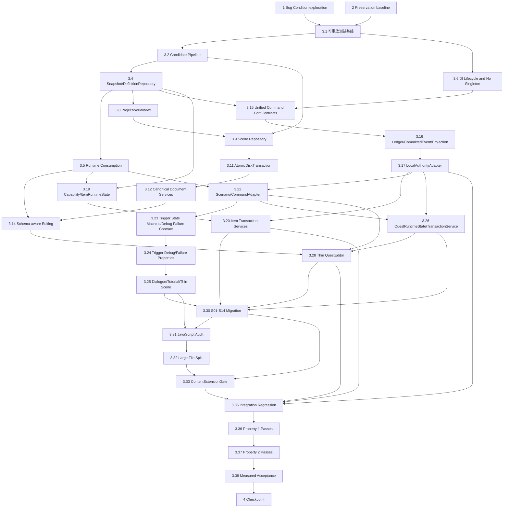

# Implementation Plan

## Overview

本计划严格基于 `bugfix.md` 与最新版 `design.md`，按“修复前 Bug Condition 探索 → 修复前 Preservation 观察 → 分域增量实现 → fix/preservation 复验 → 明确实测边界”执行。目标架构固定为 **ECS + JSON 数据驱动 + Capability Strategy/Factory + 最小运行态**，通过依赖注入组合普通 command handler、Transaction Service、State Machine、Facade、Adapter 与提交后 Event Notification。`CommittedEvent`/`ApplicationEvent` 仅在状态提交成功后通知并更新 ProjectionStore，不作为持久化来源，也不用于从通知日志重建业务状态。实现只修改现有引擎、唯一《三国张角传》Demo、编辑器与测试，不创建测试页面、普通文档、第二 Demo、Remote 网络交付或 legacy NetworkManager 命令执行接线。

## Task Dependency Graph



```json
{
  "waves": [
    { "wave": 1, "tasks": ["1"] },
    { "wave": 2, "tasks": ["2"] },
    { "wave": 3, "tasks": ["3.1"] },
    { "wave": 4, "tasks": ["3.2", "3.6"] },
    { "wave": 5, "tasks": ["3.3", "3.4"] },
    { "wave": 6, "tasks": ["3.5", "3.8", "3.15"] },
    { "wave": 7, "tasks": ["3.9", "3.16", "3.19"] },
    { "wave": 8, "tasks": ["3.10", "3.11", "3.17"] },
    { "wave": 9, "tasks": ["3.12", "3.18", "3.22"] },
    { "wave": 10, "tasks": ["3.13", "3.14", "3.20", "3.23", "3.26"] },
    { "wave": 11, "tasks": ["3.21", "3.24", "3.27"] },
    { "wave": 12, "tasks": ["3.25", "3.28"] },
    { "wave": 13, "tasks": ["3.29", "3.30"] },
    { "wave": 14, "tasks": ["3.31"] },
    { "wave": 15, "tasks": ["3.32"] },
    { "wave": 16, "tasks": ["3.33"] },
    { "wave": 17, "tasks": ["3.34", "3.35"] },
    { "wave": 18, "tasks": ["3.36"] },
    { "wave": 19, "tasks": ["3.37"] },
    { "wave": 20, "tasks": ["3.38"] },
    { "wave": 21, "tasks": ["4"] }
  ]
}
```

wave 6 的 3.15 同时依赖 wave 5 的 3.4 与 wave 4 的 3.6；3.23 在 3.22 后实施，新增的必做 3.24 在 3.23 后验证并阻塞 3.25；其余可选属性测试子任务依赖紧邻实现任务，并在对应下游集成任务前完成。精确依赖同时写在各任务的 `_Depends on` 注解中。

## Tasks

- [x] 1. 编写 Bug Condition exploration property test（修复前）
  - **Property 1: Bug Condition** - Modular Canonical Architecture and Unified Commands Satisfy the Correct Predicate
  - **CRITICAL**：必须在任何修复实现之前编写并运行；测试在未修复代码上必须失败，失败即证明 Bug Condition 存在，不得为让测试通过而修改断言或业务代码。
  - 按 `isBugCondition(input)` 生成/固定 `SCENE_LIFECYCLE`、`CONFIG_RELOAD`、`PROJECT_WORLD`、`SCENE_REFRESH`、`EDITOR_MUTATION`、`WORLD_GRID_SAVE`、`SCHEMA_EDIT`、`CANONICAL_LOAD_FAILURE`、`ROUND_TRIP`、`CANDIDATE_SUBMIT`、`JAVASCRIPT_AUDIT`、`CONTENT_EXTENSION`、`QUEST_RUNTIME`、`COMMAND_EXECUTION` 输入；每类先使用 design 中列出的确定性最小反例，再用可重放 seed 扩展输入。
  - 断言 `expectedBehavior(result,input)`：唯一所有权/严格更新释放、完整候选校验与消费、项目参数纯派生、磁盘优先与受限 fallback、编辑器提交顺序、无损编辑、错误分类、单一职责审计、Trigger 唯一执行内核、QuestRuntimeState/QuestTransactionService、统一 command execution port 和 JSON-only/JS diff=0。
  - 使用 Vitest 单次运行、spy trace、内存 disk/cache adapter、阶段 fault injection、fake logical/monotonic/wall clocks、seeded RNG 和 loopback fake transport；不得创建测试 HTML、启动 dev server 或连接外部服务。
  - **EXPECTED OUTCOME**：至少稳定产生 design“Exploratory Bug Condition Checking”中的反例；输出最小 command sequence、seed、输入 snapshot、actual trace、失败 phase 和 counterexample，并把每个反例归入唯一 phase。
  - 记录重复 update/dispose、Singleton/模块级全局实例、null 当缺失、Demo 默认泄漏、缓存旧 ID、编辑器部分提交、round-trip 变异、定义覆盖、物品/UI 旁路、Trigger 提前提交、Quest 双算法/奖励部分提交、requestId/operationId 混淆、state revision/notification gap、时钟/RNG 漂移等反例。
  - 完成条件：测试已写入并在未修复代码上运行，失败与最小反例已记录；不得在本任务中实施修复。
  - _Requirements: 1.1, 1.2, 1.3, 1.4, 1.5, 1.6, 1.7, 1.8, 1.9, 1.10, 1.11, 1.12_

- [x] 2. 编写 Preservation property tests（修复前）
  - **Property 2: Preservation** - Non-Buggy Inputs Retain Existing Observable Behavior
  - **IMPORTANT**：遵循 observation-first；先在未修复代码上观察 `¬C(X)` 输入，再冻结 golden snapshot/trace，最后写属性断言，不能以设计期假设替代现状观测。
  - 观察并冻结当前 Demo 身份/旧内容拒绝、A–D 世界布局与单次 offset、业务事务与 operationId、streaming latest-wins/逆序回滚、Snapshot 两阶段恢复、统一输入优先级、装备事件出口、QuestPanel/Tracker 可观察行为、S01–S14/六结局提交后通知顺序及 2D/3D 业务结果。
  - 冻结 InventoryTransactionService 接受量/回滚、EquipmentSystem `equipItem/unequipItem`、背包满卸装撤销、`BaseGameScene.onEquipmentChanged`、`equipItem/unequipItem` 分离和 `mainhand→weapon` payload；不得在诊断归一化时忽略业务差异。
  - 冻结 BattleClient/JSON-RPC/LocalMockTransport requestId 兼容行为，同时证明当前交付仍为单机、NetworkManager legacy state-sync 未接入统一 command execution chain。
  - 对不能安全并行运行的实现使用迁移前 golden，而不是共享可变状态；`normalizeDiagnostics` 只允许移除新增 provenance/phase/audit metadata。
  - **EXPECTED OUTCOME**：所有 preservation tests 在未修复代码上通过，形成修复后的比较基线；性能、内存、双后端和释放指标仅建立待实测记录格式，不宣称已通过。
  - _Requirements: 3.1, 3.2, 3.3, 3.4, 3.5, 3.6, 3.7, 3.8, 3.9, 3.10, 3.11, 3.12_

- [ ] 3. 修复 Canonical Architecture and Unified Command Execution
  - 状态：3.1–3.26 及已完成的可选属性测试保留为既有完成事实；3.28、3.30–3.33、3.35–3.38 与检查点仍在进行或等待验证；3.27、3.29、3.34 为尚未启动的可选属性测试。
  - 按以下子任务增量实施；每个子任务只跨越一个主要风险域，完成自身 diagnostics 与针对性 Vitest 后再解除下游依赖。
  - 禁止创建测试页面、普通文档、第二个 Demo、Remote 网络交付或 legacy NetworkManager 权威接线；禁止把 build/dev server 作为任务。
  - [x] 3.1 建立可重放的模型测试基础设施
    - 复用 Vitest，提供确定性 seed generator、model-based command runner、spy trace、内存 disk/cache/transaction adapters、阶段 fault injector、fake clocks、authority RNG 和 loopback fake transport。
    - 所有失败输出 seed 并按“先删命令，再缩字段/集合/数值”收缩；保留任务 1 的反例与任务 2 的 golden，不将测试工具变成运行时事实源。
    - _Depends on: 1, 2_
    - _Bug_Condition: `isBugCondition(input)` 的全部 ArchitectureOperation 生成域可被稳定重放_
    - _Expected_Behavior: `expectedBehavior(result,input)` 可由统一 trace/model oracle 判定_
    - _Preservation: 只增加测试基础设施，不改变运行时、编辑器或 Demo 行为_
    - _Requirements: 1.1, 1.12, 2.1, 2.12, 3.1, 3.12_

  - [x] 3.2 实现 P0.2 数据和契约 — CanonicalCandidatePipeline 与完整校验
    - 固定 `read → parse(source/line/column) → defaults clone → schema → reference → businessRule → canonicalize` 阶段；用 `hasOwnProperty` 区分缺失/null/undefined，只对真正缺失字段应用 schema default。
    - 扩充统一 schema/reference/business-rule validation，覆盖全部顶层、嵌套、数组、跨文档引用、capability/action/command/scenario/quest 业务约束；一次返回候选根路径错误且不跳过可独立错误。
    - 保证 canonicalize 纯函数、输入不变、数组顺序/字段存在性/未知合法字段保留，仅执行 schema 明示规范化。
    - 统一 `ContentOperationResult` 的 phase/source/category/path/line/column/fallback；失败保留 last successful state，空白模板必须 non-canonical、不可保存且无项目专属内容。
    - _Depends on: 3.1_
    - _Bug_Condition: CONFIG_RELOAD、CANONICAL_LOAD_FAILURE、CANDIDATE_SUBMIT 命中绕过完整校验、null 静默默认或错误分类缺失_
    - _Expected_Behavior: 完整候选在发布前通过全部校验；非法候选零修改并保留最后有效状态_
    - _Preservation: 当前合法 schemaVersion/meta/campaign 与旧内容拒绝策略不变_
    - _Requirements: 2.2, 2.8, 2.10, 3.1, 3.11_

  - [x]* 3.3 为 CanonicalCandidatePipeline 增加属性测试（可选）
    - **Property 3: Fix Checking** - Schema Defaults, Validation Paths, and Canonical Idempotence
    - 生成 schema-valid/invalid 配置树、缺失/null/错误类型/越界值及引用图，验证默认值语义、错误根路径、旧状态保持、输入不可变与 `canonicalize(canonicalize(x)) = canonicalize(x)`。
    - _Depends on: 3.2_
    - _Requirements: 2.2, 2.8, 2.9, 2.10_

  - [x] 3.4 实现 P0.2 数据和契约 — 不可变 CanonicalSnapshot 与 DefinitionRepository
    - 由 pipeline 在 shadow 中构建全部 definitions、RuntimeConfigSnapshot、Blackboard/Trigger/registries/consumer drafts，成功后一次发布不可变 CanonicalSnapshot。
    - `DefinitionRepository.fromSnapshot` 按 kind/ID 建只读索引，拒绝缺 ID、同 kind 重复、声明为全局唯一时的跨 kind 冲突、未知 capability/strategy、非法参数和悬空引用；deep-freeze 定义、参数和索引。
    - 运行中命令锁定开始时的 definition revision；新命令才观察新 revision。兼容 Registry 委托 repository，不再正式持有 mutable register/remove/clear 状态或把完整定义写入存档。
    - GameLoader 只在 shadow 构建全部成功后交换 project、registries、Blackboard、Trigger、world 和 consumers；失败保持旧快照完整可运行。
    - _Depends on: 3.2_
    - _Bug_Condition: CONFIG_RELOAD、CONTENT_EXTENSION、QUEST_RUNTIME 中逐项覆盖、重复 ID 静默覆盖或发布半成品_
    - _Expected_Behavior: 不可变 shadow replacement、revision 隔离、重复定义发布前拒绝_
    - _Preservation: 现有合法 Registry 查询结果与当前 Demo 空 quests 的合法加载保持一致_
    - _Requirements: 2.2, 2.7, 2.10, 2.12, 3.1, 3.3, 3.7_

  - [x] 3.5 实现 P0.2 数据和契约 — ConfigConsumptionRegistry 与 runtime consumption
    - 按 schema path pattern 和 `definitionKind + capabilityId + strategyId` 登记通用 consumer、descriptor、可观察事件/状态投影；未登记或无法证明消费的配置在提交前拒绝。
    - 将火堆表现、生成数量/间隔、月份、天气、救援波次/deadline/撤离半径/跟随距离、提示文案及 scene gameplay 等消费者改为只读 snapshot/config view，移除同义程序常量覆盖。
    - consumer 只按通用 ID/类型/strategy 解析，不新增 scene/content/field 分支；配置重载失败时保留旧 consumer 实例和最后有效快照。
    - _Depends on: 3.4_
    - _Bug_Condition: CONFIG_RELOAD 或 SCHEMA_EDIT 中合法配置已提交但运行结果仍由程序常量控制_
    - _Expected_Behavior: 有效字段修改均产生可观察消费结果，非法值拒绝且旧配置继续运行_
    - _Preservation: 当前 canonical 值对应的表现、月份、天气、救援、距离和提示保持不变_
    - _Requirements: 2.2, 2.7, 2.12, 3.3, 3.10_

  - [x] 3.6 实现 DI Unique Ownership、Lifecycle Container 与 No Singleton
    - 扩展 SceneSystemContainer registration 为 identity、OWNED/BORROWED、order/sequence、frame token、hooks 和 disposed；拒绝同实例第二个 owned 登记及隐式同名覆盖。
    - GameSceneRuntime 成为 container/input/disposer/自建 SnapshotManager 的唯一 owner；注入依赖明确 borrowed。Assembler 仅返回 SystemRegistrationPlan，不再保留更新/释放循环。
    - 由依赖注入根和 lifecycle container 创建、登记、借用与释放需要逻辑唯一的 CommandGateway、clock、RNG、repository、Transaction Service 和 ProjectionStore；禁止 Singleton、模块级可变实例、静态 service locator 与隐式全局 registry。
    - SceneFramePipeline 只调用 Runtime 阶段入口；兼容 context/scene 字段仅为 borrowed projection；每个 frame token 按 `(order,sequence)` 恰好更新一次。
    - SceneLifecycleCoordinator/BaseGameScene 只保留单一幂等 exit 入口；严格逆序且仅释放 owned 一次，borrowed 只解除投影，迟到异步写回由 ResourceScope 门闩拒绝。
    - _Depends on: 3.1_
    - _Bug_Condition: SCENE_LIFECYCLE 的身份、次数、顺序、owned/borrowed、逻辑唯一实例或重复释放不变量被破坏_
    - _Expected_Behavior: lifecycle container 管理唯一 owner 和注入身份，拒绝 Singleton，严格一次更新、逆序一次释放且重复 dispose no-op_
    - _Preservation: 既有 SceneFramePipeline 更新相对顺序、转场提前返回和输入清帧语义不变_
    - _Requirements: 2.1, 3.3, 3.8, 3.12_

  - [x]* 3.7 为生命周期登记图增加属性测试（可选）
    - **Property 4: Fix Checking** - Owned/Borrowed Exactly-Once Lifecycle Trace
    - 生成实例身份图、别名、order/sequence、替换、帧数和重复 dispose 调用，与严格 trace model 对比每帧更新及逆序释放。
    - _Depends on: 3.6_
    - _Requirements: 2.1, 3.12_

  - [x] 3.8 实现 P6.1 世界流式与恢复 — ProjectWorldIndex 与单次世界投影
    - `ProjectWorldIndex.build` 在世界写入前校验 rows/cols/grid/chunk 尺寸、唯一 scene 定位、reserved 语义和显式唯一非 reserved `worldMap.entrySceneId`。
    - WorldMapLoadSession、core WorldStreamingManager、ChunkNavigator、Minimap 和 WorldMapEditor 只消费 index API，移除 20×20、1280×720、S01、首格或旧类名 fallback。
    - 冻结场景局部坐标；只经 SceneObjectProjector/单一投影入口应用一次 offset，并让碰撞、表现、交互、sortY、points/path 和 2D/3D adapter 共享投影结果。
    - _Depends on: 3.4_
    - _Bug_Condition: PROJECT_WORLD 对非 Demo 尺寸/入口项目仍使用固定边界、入口或重复 offset_
    - _Expected_Behavior: bounds/entry/offset 只由项目派生，局部输入不变且 offset 恰好一次_
    - _Preservation: 当前 A–D 20×20 网格、S01 入口、1280×720 和 reserved 拒绝结果不变_
    - _Requirements: 2.3, 3.2, 3.5, 3.9_

  - [x] 3.9 实现 P6.1 世界流式与恢复 — 磁盘优先 CanonicalSceneRepository
    - 每次 refresh 重读并校验项目元数据、磁盘 `_scene_order.json` 和同 ID canonical JSON；可读磁盘列表独占决定 ID 集合，不与缓存求并集。
    - 原子替换 immutable repository snapshot；更新/删除/重命名按磁盘现状刷新同 ID 内容、删除缺失 ID 缓存，并记录 per-ID provenance 和 disk revision。
    - cache entry 携带 same-ID 来源、schemaVersion、validatorFingerprint、refreshedAt、eligible；只对 unreadable/按 3.6 允许的 parseFailed 使用最近成功且当前有效的同 ID fallback，并显式标注 source/fallback/reason。
    - missing/schema/reference/business-rule failure 禁止 fallback；磁盘有效时禁止 fallback；audit/publish 固定禁用缓存；WorldMapLoadSession 仅在单 generation 内复用 snapshot。
    - _Depends on: 3.2, 3.8_
    - _Bug_Condition: SCENE_REFRESH 使用 stale ID/content、把 rename 当旧 ID 或无 provenance 回退_
    - _Expected_Behavior: disk determines IDs/content，受限 fallback 同 ID、可验证且显式_
    - _Preservation: 当前同 ID 磁盘优先、运行/缩略图受限 fallback、审计/发布不读缓存_
    - _Requirements: 2.4, 2.6, 2.8, 3.5, 3.6_

  - [x]* 3.10 为世界索引和场景仓库增加状态机属性测试（可选）
    - **Property 5: Fix Checking** - Project Derivation and Disk/Cache Provenance
    - 生成一致世界项目、局部坐标、磁盘列表/文件 revision、delete/rename 和四类读取故障，检查数学派生、输入冻结、repository model、fallback eligibility 与 provenance。
    - _Depends on: 3.8, 3.9_
    - _Requirements: 2.3, 2.4, 2.6, 3.2, 3.6_

  - [x] 3.11 实现 P0.2 数据和契约 — AtomicDiskTransaction
    - 在开发服务器提供仅能操作当前项目允许 JSON 路径的 canonical transaction endpoint；普通 `/api/save-file` 不再承载 canonical 项目/场景提交。
    - AtomicDiskAdapter 在仓库独占锁内用 temp、备份和恢复 journal 提交 replace/create/rename/delete change set；完整预写/校验后执行，全部磁盘动作完成并线性化 journal 才形成 commit point。
    - commit 前任一步失败恢复磁盘并清理 temp，内存/缓存不变；启动时恢复未完成 journal。commit 后不得因内存或缓存失败回滚磁盘。
    - _Depends on: 3.2, 3.9_
    - _Bug_Condition: EDITOR_MUTATION/CANDIDATE_SUBMIT 在完整校验前写盘、提交失败留下半重命名或错误回滚已提交磁盘_
    - _Expected_Behavior: 单一原子磁盘操作形成持久化边界，崩溃恢复只有提交前或提交后状态可见_
    - _Preservation: 当前项目原磁盘来源与允许路径不变，不引入第二持久化来源_
    - _Requirements: 2.5, 2.10, 3.11_

  - [x] 3.12 实现 CanonicalDocumentModel、CanonicalDocumentService 与 EditorSceneCommandService
    - 每个打开项目只创建一个 CanonicalDocumentModel，持有 sourceUri/schemaId/originalCanonical/workingCopy/dirtyPaths/snapshotRevision，并统一 path patch、undo/redo 和 committed snapshot。
    - create/update/rename/delete/import/save 固定执行“完整候选 patch → schema/reference/business-rule validate → canonicalize → AtomicDiskTransaction → committed memory → best-effort cache → notify”。
    - create/import 同事务提交场景文件、项目元数据和列表；update/save 原位写回 sourceUri；rename 同事务更新全部支持引用、新文件/列表/项目并删除旧文件；delete 对仍被引用项提交前拒绝。
    - commit 后内存异常从磁盘 committed snapshot 重建；cache 失败使相关 entry 立即失去 fallback 资格，返回 committed-with-degradation，UI 不得误报候选失败或普通成功。
    - WorldMapEditor 只接受 repository closure 内 ID；普通或 reserved grid 出现 cache-only ID 时整份候选拒绝且磁盘/内存/缓存零修改。
    - _Depends on: 3.11_
    - _Bug_Condition: EDITOR_MUTATION/WORLD_GRID_SAVE/CANDIDATE_SUBMIT 的验证、磁盘、内存、缓存、通知顺序或 rollback boundary 错误_
    - _Expected_Behavior: 六类编辑命令遵守单一提交顺序，重命名/删除无旧可加载残留，post-commit cache failure 明确降级_
    - _Preservation: 场景、世界地图与配置仍写回加载时同一 canonical 来源_
    - _Requirements: 2.5, 2.6, 2.10, 3.6, 3.11_

  - [x]* 3.13 为编辑器事务增加模型属性测试（可选）
    - **Property 6: Fix Checking** - Atomic Editor Command State Machine
    - 生成六类 EditorCommand、引用变更和每个 phase 的故障索引，与 disk/memory/cache 三快照模型比较；断言 commit 前零修改、commit 后缓存失败不回滚磁盘且 fallback 失效。
    - _Depends on: 3.12_
    - _Requirements: 2.5, 2.6, 2.10_

  - [x] 3.14 实现 Schema-aware 全字段无损编辑基础
    - SchemaFieldEditor 从同一 runtime schema registry 生成 object/array/scalar/enum/ref/nullable/optional/capability/action 字段控件；明确区分 null、缺失、空字符串、0 和 false。
    - Scene/System/Trigger/Dialogue/tutorial/config editors 共享 CanonicalDocumentModel，只提交候选根 path patch；保留数组顺序、稳定 ID/引用、InputHints、assetId=imageId 和 unknown-but-allowed 字段。
    - 移除 SceneEditorHistory 的隐式 imageAssets 清理和全局舍入；load/preview/export/import 不注入 ID、时间戳、路径、旧对象或程序生成内容；普通 round-trip 不执行隐式迁移。
    - endings、skills、四类 progression graph、battle、rescue、presentation、scene gameplay，以及 item/equipment/resourceNode/construction/vehicle/tutorial/scenario/trigger/dialogue 全字段接入共享 registry，并由 ConfigConsumptionRegistry 证明消费。
    - _Depends on: 3.5, 3.12_
    - _Bug_Condition: SCHEMA_EDIT/ROUND_TRIP 丢字段、改数组/ID/引用、写第二来源或保存后 runtime 不消费_
    - _Expected_Behavior: 全字段 schema-aware path 编辑、完整候选校验、同源写回和 canonical 深相等 round-trip_
    - _Preservation: 当前有效编辑数据逐字段存在性、类型、null/缺失、数组顺序和引用不变_
    - _Requirements: 2.7, 2.9, 2.10, 3.11_

  - [x] 3.15 实现 Unified Local-First Command Execution Port 契约
    - 定义 ClientIntent、AuthoritativeCommand、CommandResult、CommittedEvent/ApplicationEvent、Projection schema，严格分离 definition/state/event/projection revision 与 snapshotSchemaVersion。
    - CommandGateway 完成 intent schema/reference、actor/session、operationId、definitionRevision/expectedStateRevision 校验并构造标准命令；所有 UI/Trigger/Scene/业务 client 只依赖 CommandGateway/AuthorityPort。
    - LocalAuthorityAdapter 保留为统一 command execution port；本地执行也必须经过序列化、schema、fingerprint、普通 command handler、result/notification validation 边界，不允许直接 handler 旁路或 `if(online)` 业务分支。
    - 仅保留 RemoteAuthorityAdapter/WebSocketJsonRpcTransport 接口和 loopback fake 测试边界；不实现生产 WebSocket、账号/房间/匹配/社交/多人、预测回滚、断线会话、数据库、云存档或部署。
    - _Depends on: 3.4, 3.6_
    - _Bug_Condition: COMMAND_EXECUTION 绕过 gateway/authority port、混用 revision、绕过 lifecycle-managed dependency 或依据 transport 改变业务规则_
    - _Expected_Behavior: 所有业务修改经过同一 command execution port 与普通 command handler，LocalAuthorityAdapter 契约统一且当前单机/future-ready 边界清晰_
    - _Preservation: BattleClient/LocalMockTransport 仍为当前唯一外部战役服务，不声明在线玩家_
    - _Requirements: 2.1, 2.12, 3.3, 3.4, 3.7, 3.10_

  - [x] 3.16 实现 Operation Ledger、确定性时钟/RNG、提交后通知和 ProjectionStore
    - 将 IdempotencyStore 分为 request response dedupe 与 operation ledger；原子 claim/in-flight/committed/failed，支持同 fingerprint 等待/首次结果重放、不同 fingerprint conflict、owner token finalize、容量/TTL/持久化恢复。
    - 注入 logical/monotonic/wall clocks 与 `{seed,stream,substream,counter}` authority RNG；业务判定禁用全局 Date/new Date/Math.random，失败事务不得推进 RNG counter。
    - 仅在 service-owned state commit 成功后按顺序产生并发布 CommittedEvent/ApplicationEvent；ProjectionStore 校验 eventId/sequence/state revision/operationId，重复幂等忽略，缺口或 revision 跳跃停止应用并请求缺失通知/snapshot。通知日志不得作为业务状态持久化来源或恢复来源。
    - AuthoritySnapshot 保存 definition revision、state revisions、lastEventSequence、logical clock、RNG state、operation ledger、service states/provider metadata；恢复以 service states 为准，并保持全 provider 预检与含当前失败项的严格逆序回滚。
    - _Depends on: 3.15_
    - _Bug_Condition: COMMAND_EXECUTION 的 requestId/operationId 混淆、并发 claim 竞态、state revision 覆盖、提交前通知、通知缺口、时钟/RNG 重放漂移或快照不完整_
    - _Expected_Behavior: 重试只提交一次、冲突零修改、通知仅提交后有序发布、ProjectionStore 可刷新/重建且 snapshot replay 确定_
    - _Preservation: JSON-RPC requestId 响应匹配、Snapshot 两阶段恢复和长期 settlement ledger 语义不变_
    - _Requirements: 2.12, 3.4, 3.7, 3.9, 3.10_

  - [x] 3.17 实现 LocalAuthorityAdapter parity 与 legacy 网络隔离
    - LocalAuthorityAdapter 使用 3.15/3.16 的统一 command handler、ledger、state revision、clock/RNG、CommittedEvent/ApplicationEvent 和 snapshot 契约；将 Quest、Inventory、Battle、Rescue、Construction、Vehicle、Ending 等业务入口逐模块迁入。
    - 建立仅用于测试的 loopback/fake RemoteAuthorityAdapter，证明同 command sequence 的 result/notification/revision/projection canonical parity；不连接服务器。
    - 复用 BattleClient/JsonRpcProtocol/LocalMockTransport 的 requestId 层；transport timeout 只表示 attempt 未知，调用方以新 requestId、同 operationId 查询/重试。
    - 对 NetworkManager PLAYER_SYNC/预测/reconcile 建立静态隔离门禁，禁止任何 command execution/service state/snapshot 模块 import 或调用；WebSocketClient 仅保留未来薄 transport 可复用基础。
    - _Depends on: 3.16_
    - _Bug_Condition: COMMAND_EXECUTION 在本地/未来 adapter 间契约不一致或 legacy client state 可覆盖 service-owned state_
    - _Expected_Behavior: Local 与 fake Remote 契约等价，request 与 operation 幂等分离，legacy 网络保持隔离_
    - _Preservation: 当前单机 LocalMockTransport 行为和 malformed/mismatch 响应规则保持_
    - _Requirements: 2.12, 3.4, 3.7, 3.10_

  - [x]* 3.18 为统一 command execution port 增加属性测试（可选）
    - **Property 7: Fix Checking** - Operation Replay, State Revision, Post-Commit Notification, Projection, and Adapter Parity
    - 生成 requestId/operationId/fingerprint、并发 claim、expected state/definition revision、notification duplicate/gap/out-of-order、snapshot cut point、fake clock/RNG command sequence；比较 LocalAuthority 与 loopback fake RemoteAuthority 的 CommandResult、CommittedEvent/ApplicationEvent 和 projection。
    - _Depends on: 3.17_
    - _Requirements: 2.12, 3.4, 3.7, 3.9, 3.10_

  - [x] 3.19 实现 ECS + JSON 数据驱动 + Capability Strategy/Factory + 最小运行态
    - 为 stackable/consumable/equippable/throwable/container/questBound/fuel/cargo/tool/durable/placeable 建 schema、CapabilityStrategyRegistry、参数/引用/互斥/依赖校验和 consumer coverage；禁止内容类深继承或 item/content ID handler。
    - 统一 ItemDefinition、ItemRuntimeState（ItemStack/ItemInstanceState）、GroundDropProjection、DeathDropProjection；只保存 definitionId、必要 instanceId、quantity 和最小 mutable state，不复制完整定义、表现对象或资源路径。
    - 选定唯一 ItemRuntimeFactory，由 Definition + ItemRuntimeState 装配 ECS Component/表现；恢复时先验证全部 definition/instance refs，再在 shadow ECS world 重建并一次提交，Factory 不提交库存、效果或装备，表现只由稳定 assetId/imageId 投影。
    - 装备、技能、四类成长、资源节点、工事、载具/货舱、任务/救援、战役和结局统一采用“不可变定义 + service-owned minimal runtime state + Transaction Service/State Machine + ECS projection”，不复制平行 repository/service/world。
    - _Depends on: 3.4, 3.5_
    - _Bug_Condition: CONTENT_EXTENSION/SCHEMA_EDIT 中定义静默覆盖、内容深继承/分支、完整定义进入运行态或 ECS 成为事实源_
    - _Expected_Behavior: capability Strategy/Factory 可验证可消费，ItemDefinition 不可变，ItemRuntimeState 最小且 ECS 可重建_
    - _Preservation: Entity/Component/System 分层、稳定资源 ID、四类成长和既有业务系统边界不变_
    - _Requirements: 2.2, 2.7, 2.9, 2.12, 3.3, 3.9, 3.11_

  - [x] 3.20 实现 InventoryTransactionService 与 ItemLifecycleService 命令事务
    - pickup/use/drop/equip/unequip/transfer/death-drop 全部经 CommandGateway/LocalAuthorityAdapter 进入 ItemLifecycleService 普通 command handler，执行 `validate → prepare draft → commit → publish ordered CommittedEvent/ApplicationEvent → checkpoint`。
    - 库存 add/remove/transfer/batch 始终复用 InventoryTransactionService；复用 EffectResolver、LootResolver、EquipmentSystem，不重写其不变量。PickupSystem 只做候选检测/命令转发，不补 potion effect、不复制 definition、不另建 loot entity 内容规则。
    - 统一 InventoryPanel、PlayerInfoPanel、拾取弹窗和 CargoTransferView 为 intent + read-only projection；禁止 UI 直接改 Stats/Inventory/Equipment。
    - 保留真实 `equipItem/unequipItem` API、槽位映射、背包满卸装回滚、`BaseGameScene.onEquipmentChanged(messages,info)`、equipItem/unequipItem 分离和 mainhand→weapon payload。
    - _Depends on: 3.17, 3.19_
    - _Bug_Condition: CONTENT_EXTENSION/COMMAND_EXECUTION 中 pickup/UI/equipment 旁路导致定义身份漂移、事务部分提交或通知出口变化_
    - _Expected_Behavior: 所有 item lifecycle 操作由 Transaction Service 原子、幂等、定义驱动提交，并且仅在提交后产生统一有序通知_
    - _Preservation: 既有库存接受量、效果/掉落结算、装备回滚和事件兼容契约精确保持_
    - _Requirements: 2.7, 2.12, 3.3, 3.4, 3.9, 3.10_

  - [x]* 3.21 为 capability 与物品生命周期增加属性测试（可选）
    - **Property 8: Fix Checking** - Definition-Driven Item Lifecycle Transaction
    - 生成 ItemDefinition、capability 组合、ItemRuntimeState、source/target、operationId 和阶段故障，与纯 Transaction Service/ECS projection model 比较库存、装备、GroundDrop/DeathDrop、committed notifications、checkpoint 和 ledger。
    - _Depends on: 3.20_
    - _Requirements: 2.7, 2.9, 2.12, 3.3, 3.4, 3.9_

  - [x] 3.22 实现 Canonical Scenario Orchestration、TriggerGraph、ActionDescriptor 与 CommandAdapter
    - 从 CanonicalSnapshot 派生 deep-frozen ScenarioDefinitionIndex/TriggerGraph，只用于引用闭包、scope、可达性、循环、entry/exit 和编辑视图，不执行、不序列化、不独立 patch。
    - 统一项目 trigger behavior 与场景 spatial binding，binding 只保存位置/范围/提示/triggerId/selector；禁止复制目标或 trigger 运行态。
    - ActionDescriptorRegistry 登记通用 params/result schema、sideEffect、operationId/checkpoint/reentry policy 和 adapter；canonical action 禁止函数、模块路径、类名、callback 或任意执行代码。
    - CommandAdapter 只做 schema/引用解析、ClientIntent 构造和结果归一化，并且只经 CommandGateway/AuthorityPort；覆盖 rescue/battle/construction/vehicle/quest/world teleport/checkpoint/ending/dialogue/tutorial 通用命令。
    - _Depends on: 3.5, 3.17_
    - _Bug_Condition: CONTENT_EXTENSION 中 scenario/trigger 引用不闭合、action 契约自由 JSON、内容专属 handler 或 Trigger 绕过普通 command handler 直接写业务状态_
    - _Expected_Behavior: TriggerSystem 是唯一执行内核，descriptor/CommandAdapter 与统一 command execution port 闭合_
    - _Preservation: 现有 Trigger 事件来源和场景 spatial binding 模型保持单一 triggerId 语义_
    - _Requirements: 2.7, 2.10, 2.12, 3.3, 3.4, 3.11_

  - [x] 3.23 修复 TriggerSystem State Machine、统一 debug 运行模式、失败可观测性、action-chain、reentry、timer 与快照契约
    - 在现有 `RuntimeConfig` 中增加唯一 `debug` 运行模式配置，并经 `GameSceneContext` 注入/投影到既有 `BaseGameScene.debugMode`、`SceneDiagnostics` 与 `TriggerSystem`；仅布尔 `true`、数字 `1`、字符串 `"1"` 归一化为启用，其余值均为禁用。不得创建第二套 debug flag、面板、日志总线或全局状态。
    - 所有 DebugPanel 打开入口统一读取上述已归一化模式：启用时允许调出已有 `DebugPanel`，禁用时任何 Trigger 失败、快捷入口或程序调用均不得打开；复用现有 `SceneDiagnostics` 记录和 DebugPanel 展示能力，调试记录不得自动删除、自动过期或在关闭面板时清空。
    - 注入单调时钟和稳定 operationId；ScenarioExecutionLedger 记录 definition revision、fingerprint、idle/running/succeeded/failed、当前 `actionIndex` 和 result，且只保存 Trigger 技术执行状态，不持有任何业务事实。修复已知反例：action 0 成功、action 1 为未知 action 时，failed ledger、`triggerFailed`/action failure event 和诊断中的失败索引必须全部为 `1`，不得沿用上一个成功索引 `0`。
    - 所有 sync/async action 均等待 CommandResult；未知 action、schema error、`ok:false`、同步 throw 或 async reject 立即停链。失败记录使用统一结构化 envelope，至少包含安全序列化且足以重放的 execution context、triggerId、失败 action descriptor/id/index、operationId、definition revision、输入 fingerprint/seed/clock 或等价 replay token、失败阶段、原因、原始异常及递归 cause；循环引用、凭据、令牌、存档隐私与其他敏感字段必须脱敏，但不得省略定位和重放所需的非敏感上下文。
    - debug 模式下，先把同一结构化失败 envelope 写入 `SceneDiagnostics` 并发送到已有 `DebugPanel`，再发送 `triggerFailed` ApplicationEvent，最后以明确 throw/rejected Promise 向开发者暴露失败；禁止只 `console.warn`、只返回 `ok:false` 或 catch 后吞掉。原始 Error/cause 身份及安全 stack/cause 链必须可检查，且 ledger/event/diagnostic 共用同一失败 action index 与 operationId。
    - 非 debug 模式下仍立即停链并记录必要的内部失败状态，只向玩家返回既有安全失败反馈；不得打开 DebugPanel，不得在玩家可见消息/ApplicationEvent payload 中泄露 execution context、stack、原始异常、cause、fingerprint、seed、内部引用或其他敏感诊断字段。
    - 只有全链成功才发送 triggerSucceeded/兼容 triggerEnd final status 并提交 once/cooldown；失败可安全重试。实现 reject/queue/restart，restart 只取消未提交协调链，不撤销已提交业务事务。
    - timer 保存 remaining/nextDue 并按 definition catch-up policy 恢复；snapshot 替换前完整验证 definition/revision/action/service/binding refs 和 operation fingerprint，失败保留当前 ledger/timer/once/cooldown。
    - _Depends on: 3.22_
    - _Bug_Condition: CONTENT_EXTENSION 中 Trigger 失败仍继续、提前消费 once/cooldown、fire-and-forget、重入竞态、timer 重启漂移、失败 action index 指向上一成功动作，或 debug 失败被吞掉/仅 console.warn/泄露给玩家_
    - _Expected_Behavior: State Machine 失败停链并记录真实失败索引；统一 debug 配置严格门控已有 DebugPanel，debug 失败提供安全完整且可重放的结构化上下文并明确 reject，非 debug 只提供玩家安全反馈；成功后才一次提交技术账本_
    - _Preservation: Story/Quest/Dialogue/Tutorial/Rescue/Battle 等状态仍由各自 service/provider 恢复；复用 BaseGameScene.debugMode、SceneDiagnostics、DebugPanel、GameSceneContext/RuntimeConfig 与 TriggerSystem，调试信息不自动删除_
    - _Requirements: 2.12, 3.4, 3.7, 3.10_

  - [x] 3.24 为 Trigger/Scenario 的 debug 契约、失败索引与状态机增加针对性单元/属性测试
    - **Property 9: Fix Checking** - Trigger Failure Index, Debug Failure Exposure, Success-Only Ledger Commit, and Recoverable Timing
    - 增加 RuntimeConfig 参数化单元测试：仅 `true`、`1`、`"1"` 启用，`false`、`0`、`"0"`、null、undefined、空串及其他值禁用；验证 GameSceneContext、BaseGameScene.debugMode、SceneDiagnostics、TriggerSystem 与已有 DebugPanel 观察同一归一化结果，不产生第二调试状态。
    - 增加 DebugPanel 门禁测试：debug 启用时可调出已有面板；禁用时从失败路径、现有快捷入口和程序入口均无法打开。验证关闭/重开面板、失败后继续执行和 diagnostics 生命周期不会自动删除、过期或清空既有调试记录。
    - 固定 Property 9 已发现的最小反例 `[成功 action 0, 未知 action 1]`：断言停在 action 1，failed ledger、action failure/`triggerFailed` event 与 diagnostics 均记录 `actionIndex: 1`、同一 triggerId/operationId，且 action 2 永不执行；不得将断言放宽为 0 或仅检查“某个动作失败”。
    - 对 unknown action、schema error、`ok:false`、sync throw、async reject 分别增加 debug 模式单元测试：断言 SceneDiagnostics 与已有 DebugPanel 收到结构化记录，包含失败 action/trigger/operationId、phase、reason、原始 Error/cause、安全完整 execution context 与 replay 信息，并且调用方收到明确 throw/rejected Promise；spy 证明实现不是仅 `console.warn` 或吞错。
    - 增加敏感信息测试：结构化上下文保留定位/重放必需字段和 cause 链，但 credentials/token/save-private/cyclic values 被稳定脱敏；非 debug 模式不打开 DebugPanel，只产生面向玩家的安全失败反馈，玩家可见 event/message 不包含 stack、cause、上下文、fingerprint、seed 或内部引用。
    - 生成 trigger/scenario graph、长度至少为 2 的 action chain、任意失败位置、signal/action payload、sync/async fault、debug 配置、once/cooldown、reject/queue/restart 和 timer snapshot，与 operation model 比较：失败索引始终等于首个实际失败动作，后续动作不执行，失败不提交 once/cooldown，通知/ledger/diagnostic operationId 一致，成功链提交一次，timer/snapshot 可恢复。
    - 使用 Vitest 单次运行及现有可重放 seed/shrinker；测试必须直接覆盖现有 RuntimeConfig/GameSceneContext/BaseGameScene/SceneDiagnostics/DebugPanel/TriggerSystem 接线，不以 fake 第二调试系统替代。最小反例和调试诊断作为持久测试证据保留，不自动删除。
    - _Depends on: 3.23_
    - _Requirements: 2.12, 3.4, 3.7, 3.10_

  - [x] 3.25 迁移 Dialogue、Tutorial、Teleport、Checkpoint 与薄 Scene 边界
    - DialogueSystem 唯一拥有 session/node/history/completed；choice 只发标准 dialogueChoice，Trigger chain 成功后才推进。保留 repeatable、idleText、商店/任务交互优先级和 completed save/load。
    - Tutorial definitions 完整保存步骤、signal rules、阈值、文案和 completion policy；TutorialSystem 只持运行态，`project.tutorials` 不再被普通 Trigger 双重解释。
    - world.teleport 只调用 ChunkNavigator/RegionCoordinator，checkpoint.request 只调用 SaveGameService/SnapshotManager；目标失败保持旧 Region/位置/Story/Trigger ledger。
    - DataDrivenPrologueScene/Scene class 仅装配、转发 committed application notification/投影和协调生命周期，移除流程 timer、sceneId/stage/content 分支、奖励/Story 直写、SXX action registration 与 teleport/checkpoint callback 分支。
    - _Depends on: 3.24, 3.8_
    - _Bug_Condition: CONTENT_EXTENSION 中 Dialogue/Tutorial 双重事实、Scene 专属流程或 teleport/checkpoint 旁路_
    - _Expected_Behavior: 各域唯一 owner，Trigger 只编排通用命令，薄 Scene 不持有流程事实_
    - _Preservation: Dialogue completed/repeatable/idle、统一输入和跨 Region rollback 行为不变_
    - _Requirements: 2.12, 3.5, 3.7, 3.8, 3.10_

  - [x] 3.26 实现 QuestRuntimeState、QuestTransactionService 与唯一 QuestResolver
    - 将 QuestDefinition 作为 DefinitionRepository 的不可变定义，覆盖稳定 text/giver/turnIn/prerequisites/objectives/reward/time/repeatPolicy/triggerRefs/dialogueRefs；拒绝 runtime 字段和重复 quest/objective ID。
    - QuestRuntimeState 只保存 questRuntimeId、definitionId、state、objectiveProgress、acceptedLogicalTime、remaining、repeat、rewardSettlementLedger、tracking 和 stateRevision，由 QuestTransactionService 唯一拥有；退出 `initDefaultQuests` 正式内容源，当前 Demo 空 quests 不回填示例。
    - QuestResolver 成为 objective matching/wildcard/required/optional/count cap/completion/expiration/repeat 的唯一纯推进算法；移除或只读转发 Quest/QuestObjective 第二写路径，禁用全局时钟/RNG 和任何 UI/ECS/Trigger/storage 副作用。
    - accept/advance/abandon/turnIn/track 全部经 AuthorityPort 后的普通 command handler 进入 QuestTransactionService；turnIn 原子提交 QuestRuntimeState、奖励参与者、settlement ledger、state revision、ordered CommittedEvent/ApplicationEvent 与 checkpoint，失败含当前参与者逆序回滚。
    - 同 operationId 同 fingerprint 返回首次结果，不同 payload conflict；definition/expected state revision mismatch 在 resolver 和参与者写入前零修改。
    - _Depends on: 3.17, 3.22_
    - _Bug_Condition: QUEST_RUNTIME 定义/运行态混合、重复覆盖、双推进算法、wall clock、奖励/ledger/state revision/checkpoint 部分提交_
    - _Expected_Behavior: immutable QuestDefinition + service-owned QuestRuntimeState + sole pure QuestResolver + atomic QuestTransactionService_
    - _Preservation: 当前 QuestPanel/Tracker 接取/放弃/提交/追踪可观察结果作为迁移 golden；不保留硬编码示例内容_
    - _Requirements: 2.7, 2.10, 2.12, 3.3, 3.4, 3.7, 3.10_

  - [-]* 3.27 为 QuestRuntimeState 与 QuestTransactionService 增加属性测试（可选）
    - **Property 10: Fix Checking** - Sole QuestResolver and Atomic Reward Settlement
    - 生成 QuestDefinition/QuestRuntimeState、重复 ID、objective signals、time/repeat/reward、state revision/operation 与阶段故障，与纯 QuestResolver/Transaction Service model 比较 runtime state、remaining、state revision、settlement、committed notifications 和 checkpoint。
    - _Depends on: 3.26_
    - _Requirements: 2.7, 2.10, 2.12, 3.4, 3.7, 3.10_

  - [x] 3.28 实现薄 QuestEditor 与只读 Quest UI projection
    - QuestEditor 复用 SchemaFieldEditor、CanonicalDocumentModel、ScenarioDefinitionIndex/TriggerGraph、共享 undo/validation 和 CanonicalDocumentService→AtomicDiskTransaction；禁止独立 fetch/save/localStorage/validator/document/undo。
    - 提供 QuestDefinition 列表及稳定 ID 创建/复制/重命名/删除，objectives/reward/prerequisites 全字段编辑，trigger/dialogue/scene refs 合法选择和引用图错误定位；重命名/删除在同一完整候选更新引用或精确拒绝。
    - runtime 预览只读显示 QuestRuntimeState 的 state/progress/remaining/repeat/tracking/settlement/stateRevision，不得编辑或保存运行时 snapshot。
    - QuestPanel、Tracker、NPC marker、HUD 只消费 ProjectionStore immutable view，并只发 accept/advance/abandon/turnIn/track intent。
    - _Depends on: 3.14, 3.22, 3.26_
    - _Bug_Condition: SCHEMA_EDIT/QUEST_RUNTIME 中 QuestEditor 形成第二文档/保存路径或 UI 直接修改 QuestRuntimeState_
    - _Expected_Behavior: QuestEditor 为共享模型薄 adapter，UI 为 command projection 的只读消费者_
    - _Preservation: 迁移前任务面板/追踪显示与交互结果保持 golden 等价_
    - _Requirements: 2.7, 2.9, 2.10, 2.12, 3.10, 3.11_

  - [x]* 3.29 为共享文档模型和 QuestEditor 增加属性测试（可选）
    - **Property 11: Fix Checking** - Lossless Schema-Aware Path Editing
    - 生成合法 canonical 文档、nested/array/capability/quest path patch、unknown fields/null/缺失和引用重命名，检查 load→edit→save→load canonical 等价、共享 undo/redo 与根路径错误。
    - _Depends on: 3.28_
    - _Requirements: 2.7, 2.9, 2.10, 3.11_

  - [x] 3.30 完成 P1–P5 S01–S14 Canonical 内容编排迁移
    - 按开发计划正式流程迁移：P1.1/P1.3 S01→S02 教学与推进、P2.2 S09 饥民争斗、P3.3 与 P4.3/P4.4 救援、P4.5 载具运输攻城、P5.2 S14 EndingSystem；只改 canonical definitions/bindings/resources。
    - 移除 `completeS11Beacon`、`checkS12Exit`、`commitS14Ending` 等 SXX/content 命名 handlers、JS tutorial `when`/阈值工厂、sceneId/stage 分支、剧情 setTimeout/callback 和业务状态双写。
    - S01–S14 历史人物/剧情/数值保留在 Demo canonical 数据，core 只含通用 descriptor、CommandAdapter、Transaction Service、State Machine 与普通 command handler；不得改变六结局优先级、路线、救援边界和现有业务事务政策。
    - 每个迁移切片以完全销毁 editor/runtime、清空正式内存与 cache、仅从磁盘重启为完成边界；同 snapshot/seed/clock/commands 结果一致。
    - _Depends on: 3.20, 3.25, 3.26, 3.28_
    - _Bug_Condition: CONTENT_EXTENSION 对既有 schema 可表达内容仍需 JavaScript diff 或重启后结果不一致_
    - _Expected_Behavior: TriggerSystem 唯一执行，各 Transaction Service 唯一持有 service-owned state，S01–S14 JSON-only 且 executable JS diff=0_
    - _Preservation: 当前 S01–S14 业务状态、ordered committed notifications 与焦土→旁观者→火种→余烬→流星→尘埃优先级不变_
    - _Requirements: 2.12, 3.1, 3.4, 3.5, 3.8, 3.10_

  - [x] 3.31 实现 JavaScript 物理行与单一职责审计门禁
    - 只扫描版本控制中 runtime/editor/dev-release tool 直接执行的 JS/MJS 与 HTML script；排除 JSON/data、tests/fixtures、third-party/generated/dist/build/desktop，并按物理行包含空行和注释精确计数。
    - policy 要求每个执行单元只属于 assembly/businessLogic/presentation/editorInteraction 之一；检查装配越权、业务逻辑访问 DOM/Canvas、表现写业务状态、editor 绕过 command service。
    - 静态拒绝 SXX/content handler、sceneId/stage/content 分支、剧情 timer/callback、任意 module path、业务 `if(online)`、直接业务 Date/new Date/Math.random、UI/Trigger 直接修改 service-owned state、Singleton/service locator 和整块客户端状态提交。
    - 无例外文件必须 1–1000 行；例外仅允许外部单文件契约并记录 evidence/exact lines/responsibility/owner/date/contentHash，增行立即失效且永不豁免单一职责。
    - _Depends on: 3.25, 3.30_
    - _Bug_Condition: JAVASCRIPT_AUDIT 的 scope、物理行、职责或例外规则错误_
    - _Expected_Behavior: 报告给出纳入/排除原因、精确行数、唯一职责、违规和例外状态，不自动修改源码_
    - _Preservation: 测试/fixture/第三方/生成物/构建产物与 desktop 继续排除_
    - _Requirements: 2.11, 3.3_

  - [x] 3.32 拆分超大文件并收口组合根职责
    - 依据 3.31 报告按职责拆分超过 1000 行或混责的执行单元；优先把 BaseGameScene 收口为 constructor/enter/update/render/exit、暂停和少量 Demo hook，把通用能力迁入现有 scene modules/services。
    - 将 editor/index.html 内可执行逻辑迁入明确 editorInteraction 模块；编辑器模块只协调交互并调用 CanonicalDocumentService/command service，不承载持久化实现。
    - 装配文件只构造、注入、注册、转发和生命周期协调；不迁移或复制历史内容到 core，不引入 prototype mixin、第二 owner、第二事实源或场景流程分支。
    - 每次拆分保持 import API、调用顺序、输入路由、装备出口、调试信息和可观察行为，并重新运行职责/行数审计。
    - _Depends on: 3.31_
    - _Bug_Condition: JAVASCRIPT_AUDIT 发现无有效例外的超限或混责文件_
    - _Expected_Behavior: 每个无例外执行单元 ≤1000 物理行且只有一种职责，assembly 不实现业务/表现规则_
    - _Preservation: BaseGameScene/编辑器现有合法入口与调试行为保持_
    - _Requirements: 2.11, 3.3, 3.8, 3.11_

  - [x] 3.33 实现 ContentExtensionGate 与 JSON-only/JS diff=0 自动验收
    - 记录审计范围内可执行 JavaScript 的逐文件 hash；对既有 schema/capability/ActionDescriptor 可表达的内容扩展只允许 canonical JSON 与已登记资源变化。
    - 门禁禁止新增 scene/content/field branch、SXX handler、内容子类、场景 timer/callback 或按 item ID 专属策略；只允许通用 definition lookup/schema-capability dispatch。
    - 完全销毁 editor/runtime、清空正式内存/localStorage cache，仅从 committed disk 重启，比较保存结果 canonical equality、service states、ordered committed notifications、稳定 IDs 和 JS hash change count=0。
    - _Depends on: 3.30, 3.32_
    - _Bug_Condition: CONTENT_EXTENSION 的合法数据变更需要代码分支或完整重启不能复现同结果_
    - _Expected_Behavior: 已有契约可表达内容始终 JSON-only，重启 deterministic，JavaScript diff/hash 变化数为 0_
    - _Preservation: 新增真正通用能力时仍要求同步 schema/strategy/adapter/consumer/validation/tests，而非按内容开洞_
    - _Requirements: 2.12, 3.3, 3.9, 3.10, 3.11_

  - [x]* 3.34 为 ContentExtensionGate 增加属性测试（可选）
    - **Property 12: Fix Checking** - Capability-Expressible Content Has Zero Executable JavaScript Diff
    - 生成已有 capability 可表达的物品/掉落/placement 与 scenario 数据扩展，检查 hash 集不变、完全重启 replay、definition/instance/placement ID、service-owned state 和 ordered committed notifications 一致。
    - _Depends on: 3.33_
    - _Requirements: 2.12, 3.9, 3.10_

  - [x] 3.35 执行分模块集成回归与代表性 zero-JS-diff 验收
    - 使用真实 GameLoader/DefinitionRepository/consumers 修改火堆、生成数量/间隔、月份、天气、救援波次/deadline/距离和 InputHints，验证校验、发布、消费与旧状态保留。
    - 通过临时目录 adapter 覆盖 scene update/delete/rename/fallback 和 editor create/update/rename/delete/import/save；验证 disk→memory→cache→notification 顺序及完全重启读回。
    - 对全部编辑模块各选顶层/嵌套/数组/capability 字段做同 model 全字段无损 round-trip；QuestEditor 验证 path focus、引用图、共享 undo、原位提交和只读 projection。
    - 分别执行 P1.1/P1.3 S01→S02、P2.2 S09、P4.3 S11、P4.5/P5.2 S14 和通用 capability 五组代表性场景；每组清缓存、完整重启、两轮 save/load，并断言 executable JS diff=0。
    - 对同一物品经 GroundDrop、DeathDrop、拾取弹窗、InventoryPanel/PlayerInfoPanel、Cargo transfer 进入统一命令；核对装备事件与 mainhand→weapon。
    - 覆盖 BattleClient/LocalMock/fake transport timeout/retry、notification duplicate/gap、AuthoritySnapshot cut-point rebuild、provider 当前失败项逆序回滚和 NetworkManager 隔离。
    - _Depends on: 3.17, 3.20, 3.28, 3.33_
    - _Bug_Condition: 任一端到端路径仍出现第二事实源、旁路、部分提交、提交前通知、重启漂移或 JavaScript 内容分支_
    - _Expected_Behavior: editor→disk→CanonicalSnapshot→command execution port→service-owned state→CommittedEvent/ApplicationEvent→ProjectionStore→ECS/UI 单向闭环可重复验证_
    - _Preservation: 当前 Demo、世界、业务事务、装备、输入、流式、存档、S01–S14 和结局 golden 不回归_
    - _Requirements: 2.1, 2.2, 2.3, 2.4, 2.5, 2.6, 2.7, 2.8, 2.9, 2.10, 2.11, 2.12, 3.1, 3.2, 3.3, 3.4, 3.5, 3.6, 3.7, 3.8, 3.9, 3.10, 3.11, 3.12_

  - [x] 3.36 复验 Bug Condition exploration test 已转为通过
    - **Property 1: Expected Behavior** - Modular Canonical Architecture and Unified Commands Satisfy the Correct Predicate
    - **IMPORTANT**：重新运行任务 1 的同一测试与同一反例/seed，不得另写替代测试或删除曾失败的输入。
    - 对全部满足 `isBugCondition(input)` 的输入断言 `expectedBehavior(result,input)`，并运行固定 seed 集与记录的随机 seed；失败必须保留可重放 counterexample。
    - **EXPECTED OUTCOME**：任务 1 中所有原始反例及扩展生成输入通过，证明 Bug Condition 已修复。
    - _Depends on: 3.35_
    - _Requirements: 2.1, 2.2, 2.3, 2.4, 2.5, 2.6, 2.7, 2.8, 2.9, 2.10, 2.11, 2.12_

  - [x] 3.37 复验 Preservation property tests 仍通过
    - **Property 2: Preservation** - Non-Buggy Inputs Retain Existing Observable Behavior
    - **IMPORTANT**：重新运行任务 2 的同一 observation-first tests/golden，不得为适配新实现放宽业务状态、提交后通知顺序、ID、引用、接受/拒绝或 committed 状态比较。
    - 比较修复前 golden、修复后 2D 和修复后 3D 的 normalized diagnostics 与完整业务 trace；只忽略允许新增的 provenance/phase/audit metadata。
    - 确认 Demo identity、A–D 布局、业务事务、streaming、snapshot、输入、装备、Quest UI、LocalMock-only、S01–S14 和六结局优先级无回归。
    - **EXPECTED OUTCOME**：全部 preservation tests 通过，证明非 Bug Condition 行为保持。
    - _Depends on: 3.36_
    - _Requirements: 3.1, 3.2, 3.3, 3.4, 3.5, 3.6, 3.7, 3.8, 3.9, 3.10, 3.11, 3.12_

  - [~] 3.38 执行 P6.2 性能和稳定性的明确实测验收
    - 在 S11 记录版本、设备/浏览器、分辨率、requested/actual backend、至少 100 个活动 ECS 实体、采样区间、平均 FPS、1% low、长任务和 draw calls；只有平均帧率实测 ≥60 才标通过。
    - 在同一 Region 连续跨界前后记录内存与峰值；只有实测峰值 `<100MB`，并确认 owner/listener/timer/resource/async token 无新增残留才标通过。
    - 从同一 AuthoritySnapshot、seed、fake clocks 和 commands 分别运行 2D/3D，比较 service-owned state、ordered committed notifications、state revision、RNG counters 和 projection；只有 canonical diff=0 才标通过。
    - 对 LocalAuthority snapshot 执行两轮 save→load→replay，验证 provider rollback、definition/state revisions、notification sequence、logical clock、RNG、operation ledger 和 service states 等价。
    - 此任务必须由实际运行证据完成；自动测试或设计推断不得替代浏览器/目标设备测量，未实测项保持未完成，不得写成已通过事实。
    - _Depends on: 3.37_
    - _Bug_Condition: JAVASCRIPT_AUDIT/CONTENT_EXTENSION/SCENE_LIFECYCLE 修复后仍存在性能、双后端或释放残留风险_
    - _Expected_Behavior: 只以真实测量判定 60 FPS、<100MB、2D/3D diff=0 与释放无残留_
    - _Preservation: 性能优化不得改变业务状态、ordered committed notification 顺序、输入优先级或表现资源边界_
    - _Requirements: 2.1, 2.11, 2.12, 3.9, 3.10, 3.12_

- [~] 4. Checkpoint - 确保所有自动化检查与实测边界状态明确
  - _Depends on: 3.38_
  - 运行受影响模块的 diagnostics 与针对性 Vitest 单次执行（使用 `--run`），确认任务 1 的 Property 1、任务 2 的 Property 2、分域 unit/PBT/integration 和审计门禁均通过。
  - 不自动扩大为全量测试、coverage、生产 build 或 dev server；如需扩大验证范围，先由用户决定。
  - 汇总每项验收为“自动化通过 / 实测通过 / 尚待实测 / 阻塞”，不得把未执行的浏览器、音画、性能、内存、双后端或目标设备检查描述为通过。
  - 确认没有创建测试 HTML、普通文档、Remote 网络交付、legacy NetworkManager authority 接线、第二 Demo 或第二事实源。
  - 如出现需求冲突、无法复现反例或实测阻塞，向用户提出具体问题后再继续。

## Notes

- 标记为 `- [ ]*` 的任务是可选属性测试增强；任务 1、任务 2、3.36 和 3.37 的 Property 1/2 不是可选项。
- 每个实现任务完成后只运行 diagnostics 与受影响模块的针对性 Vitest 单次执行；全量测试、coverage、生产 build 和 dev server 不属于本计划自动执行项。
- “通过”必须有对应自动化或实测证据；P6.2 的 FPS、内存、双后端和释放目标在真实测量前始终保持未完成。
