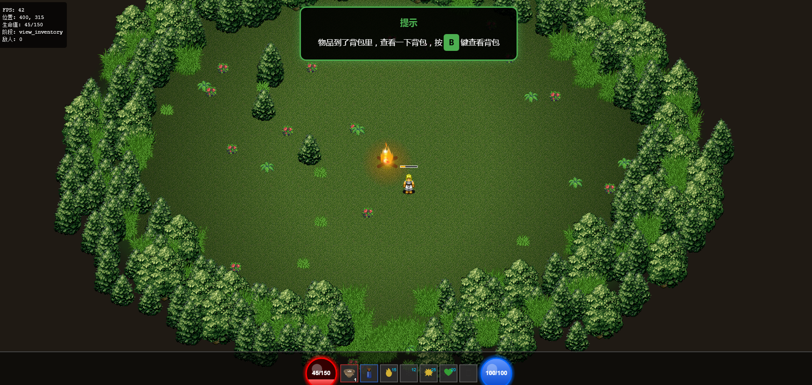
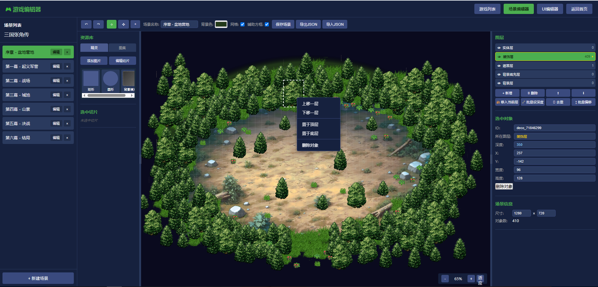

# 张角黄巾起义序章 - HTML5 MMRPG 引擎

一个基于完整 ECS 架构的 HTML5 多人在线角色扮演游戏引擎。
交流QQ群:58607027





感谢以下图片来源：
图片来源：https://opengameart.org

https://opengameart.org/content/2d-lost-garden-zelda-style-tiles-resized-to-32x32-with-additions
图标来源：ravenmore.itch.io

## 🎮 立即开始

### 快速启动

1. 克隆项目
   ```bash
   git clone https://gitee.com/coderaaa/h5game.git 
   或 
   git clone https://github.com/beiliwenxiao/h5game.git

   cd h5game
   ```

2. 安装依赖
   ```bash
   npm install
   ```

3. 启动开发服务器
   ```bash
   npm run dev
   ```

4. 打开浏览器访问示例项目
   ```
   http://localhost:3000/example/sanguo_zhangjiao/index.html
   ```

### 运行 Demo 项目

三国张角序章 Demo 位于 `example/sanguo_zhangjiao/` 目录。

**方式一：Vite 开发服务器（推荐）**

```bash
npm run dev
```

然后访问：`http://localhost:3000/example/sanguo_zhangjiao/index.html`

**方式二：直接打开文件**

直接在浏览器中打开 `example/sanguo_zhangjiao/index.html`（部分功能可能受限于跨域策略）

### 渲染模式切换

Demo 支持双渲染后端，通过 URL 参数切换：

- `?mode=2d` - Canvas 2D 渲染（默认）
- `?mode=3d` - three.js 3D 渲染
- `?mode=auto` - 自动选择（WebGL 可用时优先 3D）

示例：
```
http://localhost:3000/example/sanguo_zhangjiao/index.html?mode=3d
```

## 📖 项目介绍

本项目是一个通用的 HTML5 游戏引擎框架，采用 ECS 架构设计，核心系统与游戏逻辑分离。

### 引擎特性

- **ECS 架构**：Entity-Component-System 高性能游戏架构
- **模块化设计**：核心系统与业务逻辑完全分离
- **双渲染后端**：支持 Canvas 2D 和 three.js 3D 渲染
- **可扩展性**：易于添加新系统和组件

### 示例项目

`example/sanguo_zhangjiao/` 是基于本引擎开发的完整游戏示例，包含六幕剧情：

- 第一幕 - 绝望的开始：角色创建、教程、战斗
- 第二幕 - 张角的召唤：加入黄巾军，学习新技能
- 第三幕 - 黄巾初起：参与起义战斗，招募 NPC
- 第四幕 - 烽火连天：大规模战斗，攻城略地
- 第五幕 - 风云变幻：阵营抉择，剧情分支
- 第六幕 - 序章终章：最终决战

## 🏗️ 项目结构

```
.
├── src/                       # 引擎框架（核心）
│   ├── core/                  # 核心引擎
│   │   ├── GameEngine.js      # 游戏引擎
│   │   ├── InputManager.js    # 输入管理
│   │   ├── SceneManager.js    # 场景管理
│   │   ├── AssetManager.js    # 资源管理
│   │   ├── AudioManager.js    # 音频管理
│   │   ├── PerformanceMonitor.js
│   │   ├── ObjectPool.js      # 对象池
│   │   └── ...
│   ├── ecs/                   # ECS 架构
│   │   ├── Entity.js
│   │   ├── Component.js
│   │   ├── EntityFactory.js
│   │   └── components/        # 组件定义
│   ├── systems/               # 游戏系统
│   │   ├── CombatSystem.js
│   │   ├── MovementSystem.js
│   │   ├── EquipmentSystem.js
│   │   ├── DialogueSystem.js
│   │   ├── TutorialSystem.js
│   │   ├── QuestSystem.js
│   │   └── ...（30+ 系统）
│   ├── rendering/             # 渲染系统
│   │   ├── backends/          # 双渲染后端
│   │   │   ├── Canvas2DBackend.js
│   │   │   ├── ThreeBackend.js
│   │   │   └── ...
│   │   ├── Camera.js
│   │   ├── RenderSystem.js
│   │   ├── ParticleSystem.js
│   │   └── ...
│   ├── ui/                    # UI 组件
│   │   ├── DialogueBox.js
│   │   ├── InventoryPanel.js
│   │   ├── SkillTreePanel.js
│   │   └── ...（25+ 组件）
│   ├── scenes/                # 通用场景
│   │   ├── LoginScene.js
│   │   ├── CharacterScene.js
│   │   └── GameScene.js
│   ├── data/                  # 数据层
│   └── network/               # 网络通信
│       ├── NetworkManager.js
│       ├── WebSocketClient.js
│       └── MockWebSocket.js
├── example/                   # 示例项目
│   └── sanguo_zhangjiao/      # 三国张角序章
│       ├── index.html         # 入口文件
│       ├── assets/            # 资源文件
│       │   ├── images/        # 图片资源
│       │   └── audio/         # 音频资源
│       ├── scenes/            # 场景（Act1-6）
│       ├── systems/           # 专用系统
│       ├── config/            # 配置文件
│       ├── conditions/        # 条件函数
│       ├── entities/          # 实体定义
│       ├── data/              # 剧情数据
│       └── PrologueManager.js
├── test/                      # 测试文件
├── docs/                      # 项目文档
└── package.json
```

## 🎯 核心系统

### 引擎核心

| 系统 | 说明 |
|------|------|
| GameEngine | 游戏引擎核心，管理游戏循环 |
| InputManager | 统一输入处理（键盘、鼠标、触摸） |
| SceneManager | 场景管理与切换 |
| AssetManager | 资源加载与管理 |
| AudioManager | 音频播放与管理 |
| PerformanceMonitor | 性能监控 |
| ObjectPool | 对象池，减少 GC 压力 |

### 游戏系统

| 系统 | 说明 |
|------|------|
| CombatSystem | 战斗系统 |
| MovementSystem | 移动系统 |
| EquipmentSystem | 装备系统 |
| DialogueSystem | 对话系统 |
| TutorialSystem | 教程系统 |
| QuestSystem | 任务系统 |
| ClassSystem | 职业系统 |
| SkillTreeSystem | 技能树系统 |
| ShopSystem | 商店系统 |
| AISystem | AI 行为系统 |
| ... | 更多系统 |

### 渲染系统

| 系统 | 说明 |
|------|------|
| RenderSystem | 渲染系统（视锥剔除、批量渲染） |
| Canvas2DBackend | Canvas 2D 渲染后端 |
| ThreeBackend | three.js 3D 渲染后端 |
| ParticleSystem | 粒子系统 |
| CombatEffects | 战斗特效 |
| SkillEffects | 技能特效 |

### UI 组件

| 组件 | 说明 |
|------|------|
| DialogueBox | 对话框 |
| InventoryPanel | 背包面板 |
| AttributePanel | 属性面板 |
| PlayerInfoPanel | 角色信息面板 |
| SkillTreePanel | 技能树面板 |
| ShopPanel | 商店面板 |
| ... | 更多组件 |

## 🎮 控制方式

### 键盘

| 按键 | 功能 |
|------|------|
| W/A/S/D 或 方向键 | 移动 |
| E | 拾取物品 |
| C | 属性/装备面板 |
| B | 背包 |
| 空格 | 攻击 |
| 1-4 | 使用技能 |

### 鼠标

- 左键点击：移动到目标位置
- 右键点击：选择目标

## 📚 文档

- [快速启动指南](docs/QUICK_START_ECS.md)
- [游戏核心架构](docs/GAME_CORE_ARCHITECTURE.md)
- [ECS 快速入门](docs/QUICK_START_ECS.md)
- [引擎特性](docs/ENGINE_FEATURES.md)
- [性能优化指南](docs/PERFORMANCE_OPTIMIZATION_GUIDE.md)
- [故障排除](docs/TROUBLESHOOTING.md)

## 🔧 开发

### 环境要求

- Node.js 14+
- npm 或 yarn

### 常用命令

```bash
npm install          # 安装依赖
npm run dev          # 启动 Vite 开发服务器
npm run build        # 构建生产版本
npm test             # 运行单元测试（Vitest）
```

### 代码规范

- 使用 ES6+ 语法
- 类名使用 PascalCase
- 方法和变量使用 camelCase
- 常量使用 UPPER_SNAKE_CASE
- 遵循 ECS 架构

## 🚀 性能

### 目标

- FPS: 60（稳定）
- 实体数量: 100+
- 内存使用: < 100MB

### 优化措施

- 视锥剔除：只渲染可见实体
- 对象池：减少 GC 压力
- 批量渲染：提高渲染效率
- 离屏 Canvas：缓存静态内容

## 🤝 贡献

欢迎贡献代码！

1. Fork 项目
2. 创建特性分支 (`git checkout -b feature/AmazingFeature`)
3. 提交更改 (`git commit -m 'Add some AmazingFeature'`)
4. 推送到分支 (`git push origin feature/AmazingFeature`)
5. 开启 Pull Request

## 📄 许可证

本项目采用 MIT 许可证 - 查看 [LICENSE](LICENSE) 文件了解详情。

### 使用的技术

- HTML5 Canvas / three.js - 游戏渲染
- ES6+ JavaScript - 现代 JavaScript
- ECS 架构 - 高性能游戏架构
- Vite - 构建工具
- Vitest - 单元测试框架
- WebSocket - 多人在线通信

---

项目状态: 活跃开发中
当前版本: 0.0.1
